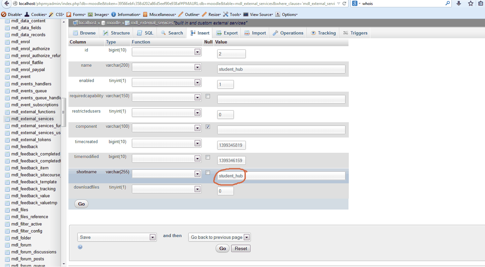

# _Moodle SilverStripe module_

_Easily connect Moodle to SilverStripe via the web services REST API._


## Project Setup

- Plop the _moodle/_ folder into your SilverStripe directory
- create _\_config/moodle.yml_
- run /dev/build?flush=all 

And you've installed the module! The **examples/MoodleExamplePage.php.example** file contains 
three example web service requests that to help you get started.

You'll need to configure **moodle.yml** with a password/username or a token 
supplied by Moodle. _(Under Site administration > Advanced features > Plugins > Web services > Manage tokens)_

Example **moodle.yml** file:
```
---
Name: MoodleWebservice
---
MoodleWebservice:
    authentication:
        username: my_moodle_username
        password: my_password
        service: webservice_name
        statictoken: 
        locationTest: http://moodle.yourtertiaryaddress.com/
        locationDev: http://moodle.yourtertiaryaddress.com/
        locationLive: http://moodle.yourtertiaryaddress.com/
```


_Your Moodle instance will need to be configured to accept web service requests._


## Example calls

    /**
     * returns a user's profile
     * @return \Dataobject|null
     */
    public function getUserProfile() {
    	// connect to moodle
    	$moodle = MoodleWebservice::connect();
    	if(!$moodle) {
    		return Debug::message('Failed to connect to Moodle Webservice');
    	}
    	
    	// create a user list containing one generic user
    	$params = array('userlist' => array(
    		(object) array(
    			'userid'=>'2',
    			'courseid' => '1'
    		)
    	));
    	
    	// call the function core_user_get_course_user_profiles
    	$userprofile = $moodle->call ('core_user_get_course_user_profiles', $params);
    	
    	// return it
    	return $userprofile->Data();
    }
	
### Example 2: get a list of programmes from a user 

    $moodle = MoodleWebservice::connect();
    if(!$moodle) {
    	return Debug::message('Failed to connect to Moodle Webservice');
    }
    
    // find programmes belonging to this user
    $params = array('userid' => '2');
    $courselist = $moodle->call ('core_enrol_get_users_courses', $params);
    return $courselist->Data();
	
### Example 3: find a user by their email address

    $moodle = MoodleWebservice::connect();
    if(!$moodle) {
    	return Debug::message('Failed to connect to Moodle Webservice');
    }
	
    $params = array('values' => array('email@op.ac.nz'), 'field' => 'email');
    $userdata = $moodle->call ('core_user_get_users_by_field', $params);
	
    return $userdata->Data();


## Configure Moodle

The most difficult integration task for this module will be configuring your 
Moodle instance to allow web service requests. There are many resources on the
 web explaining how to do this, but by far the most helpful is the Moodle check
 list under _Site administration > Advanced features > Plugins > Web services > Overview._


### Moodle configuration summary:

1. Create a user that will be used for the service
2. Create the roll for this user, with access to the web services
3. Assign your new roll to the user
4. Create an external service  
_Note: Moodle 2.5 users will have to manually set the shortname in the db _
5. Add the functions you want to call to the external service 


## Requirements

1. _cURL PHP module_
2. _Moodle 2.2+ for JSON/REST_
3. _SilverStripe 3.x_


## Integration Tests

1. Create MoodleExamplePage on a test instance
2. Save and load the page
3. Update MoodleExamplePage.php to relevent user IDs
4. View the raw output by using `Debug::show();` on the output from `$moodle->call()`


## Troubleshooting & Useful Tools

_I recommend using [Advanced REST Client](https://chrome.google.com/webstore/detail/advanced-rest-client/hgmloofddffdnphfgcellkdfbfbjeloo) for Google Chrome for debugging purposes._

> debuging your moodleWebService:
> 
> - Make sure your $params match the API docs (Under Site administration > Advanced features > Plugins > Web services > API Documentation) 
> - Moodle's API Documentation can be notirious to read, make sure you tripple check the varibles you're using
> - `Debug::show()` your call()
> - `die(print_r($url, true));` inside MoodleWebservice->call() 
> - Make sure it's working using _Advanced REST Client_


### common errors

- __Invalid parameter value detected__ - match your params with the Moodle web service client documentation
- __Access to the function XXXXXX() is not allowed.__ - add this function to the external service (see Project Setup)
- __functions return nothing__ - enable debugging mode, you'll see debug messages.


## Contributing changes

- _Fork on git_
- _Raise an issue_


## License

BSD 